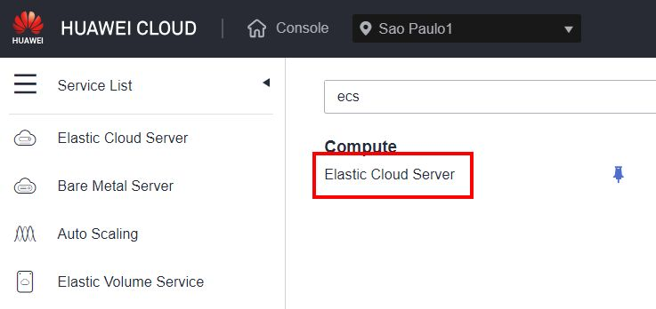
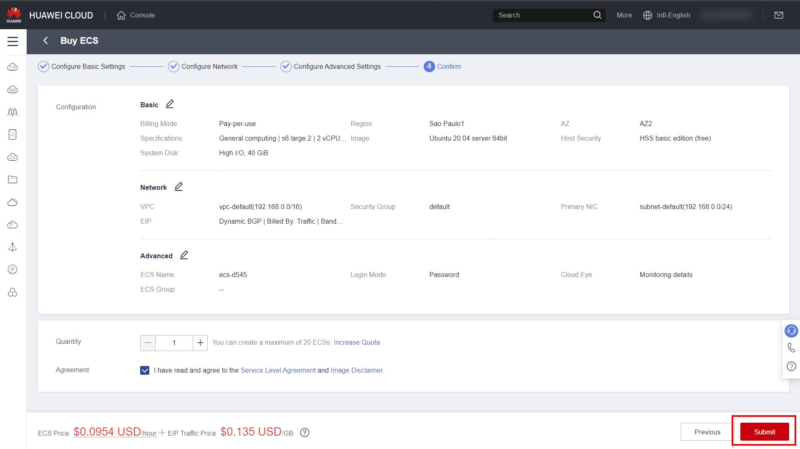
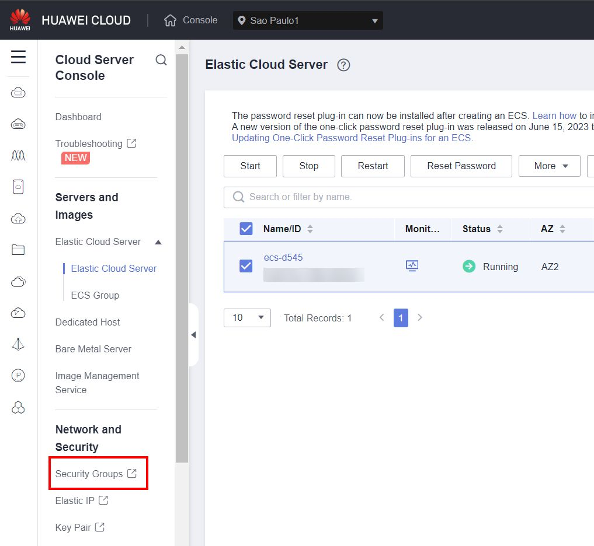
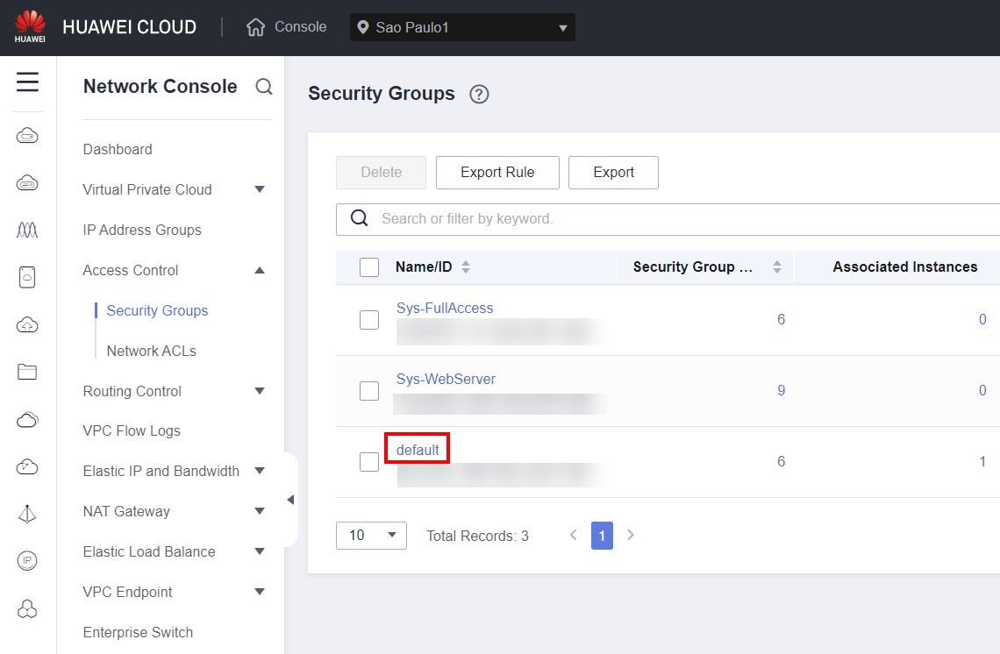
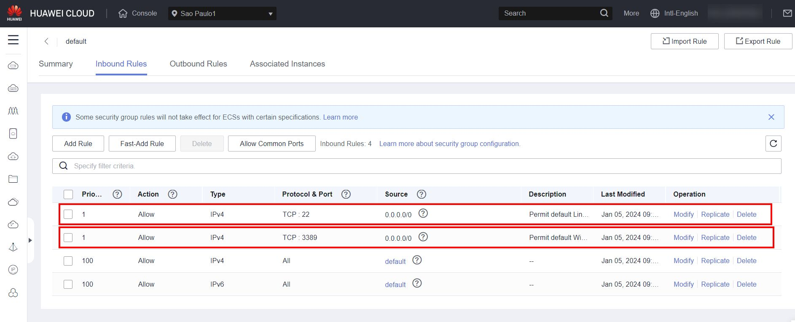
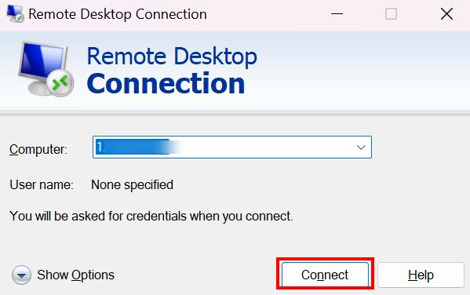
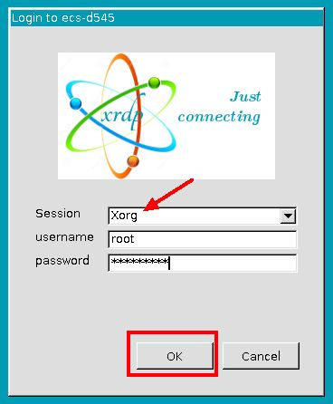
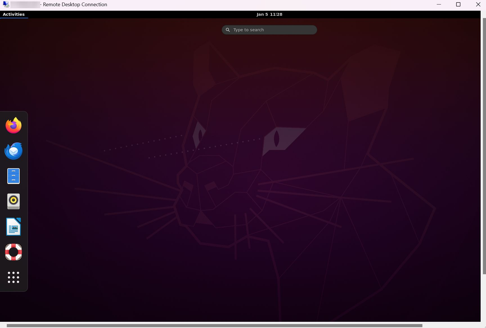

# Instalando GUI em Imagens Públicas Linux

V1.0 – Janeiro 2024

| **Versão**        | **Autor**             | **Descrição**        |
| ----------------- | --------------------- | -------------------- |
| V1.0 – 2024-01-05 | Diogo Hatz 50037923   | Versão Inicial       |
|                   | Wisley Paulo 00830850 | Revisão do Documento |

1. Índice
{:toc}

## Introdução

O Image Management Service (IMS) é um serviço disponibilizado na Huawei
Cloud que permite a administração de imagens. Imagens são nada mais que
servidores em cloud ou templates de disco que contêm um sistema
operacional (SO), dados de serviço ou software.

Este documento tem como finalidade discorrer o passo-a-passo de como
realizar a instalação de uma interface gráfica (GUI) em imagens públicas
Linux disponibilizadas no IMS. Vale ressaltar que para disfrutar da
interface gráfica, a instância deve ser acessada através de ferramentas
exteriores à console da Huawei Cloud, como o Remote Desktop do Windows.

## ECS

Acesse o console da Huawei Cloud, navegue até a seção relativa à ECS e
crie uma instância Linux com a imagem pública Linux desejada. Vale
ressaltar que para acessar a instância de ferramentas exteriores à
console, um EIP deve ser vinculado com a ECS.






Garanta que o acesso às portas 22 e 3389 do security group em que a
instância está atrelada estão abertas.







## Configurando a ECS

Acesse a ECS através da console da Huawei Cloud clicando em “Remote
Login” e faça login com o usuário “root” e senha configurada na criação
da ECS.


Atualize os pacotes da ECS digitando o seguinte comando:

```shell
apt update && apt upgrade -y
```

Instale o pacote XRDP, que permite que instâncias Linux sejam acessadas
através do Remote Desktop do Windows.

```shell
apt install xrdp -y
```

O gerenciador de interfaces GDM3 é utilizado por padrão em instâncias
Linux. Caso for desejado, outros gerenciadores mais leves podem ser
instalados, como o SLiM ou LightDM. Caso seja perguntado, altere o SLiM
ou LightDM para o gerenciador padrão.

```shell
apt install lightdm -y
```

Instale a interface visual desejada. Neste passo-a-passo, a interface
visual instalada será a Ubuntu Desktop.

```shell
apt install ubuntu-desktop
```

Reinicie o serviço XRDP para permitir acesso remoto do Remote Desktop.

```shell
service xrdp restart
```

Habilite o serviço XRDP para habilitar o serviço XRDP para iniciar na
inicialização do sistema.

```shell
systemctl enable xrdp
```

Inicie o gerenciador de interfaces instalado.

```shell
systemctl start lightdm.service
```

Faça login na instância através do Remote Desktop. Em “Session”,
selecione “Xorg”.







**Importante: Vale ressaltar que a interface gráfica instalada no Linux
não funciona bem com o Remote Login da console da Huawei Cloud. É
recomendado que o Remote Login da console seja utilizada somente com o
terminal do Linux.**
