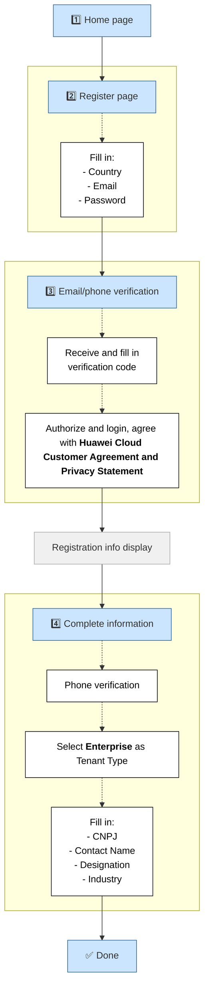

# Customer Registration

V1.0 – Nov 2025

| **Version**       | **Author**                          | **Description**      |
| ----------------- | ----------------------------------- | -------------------- |
| V1.0 – 2025-11-17 | Fernando Gabriel Chacon  50037923   | Initial Version      |
| V1.0 – 2025-11-17 | Gabriel Gutierrez  00817435         | Document Review      |

1. Index
{:toc}

## Introduction

Huawei Cloud provides a global and secure cloud platform. Before accessing cloud services, customers must create and activate their accounts through the official registration portal. This guide provides a complete and structured walkthrough for new customers to complete the registration process successfully.

## Registration Flow

<pre class="mermaid">
flowchart TD
    %% Main Flow
    A["1️⃣ Home page"] --> B["2️⃣ Register page"]

    subgraph Z[" "]
        B -.-> B1["Fill in: - Country - Email - Password"]
    end

    subgraph ZA[" "]
        B1 --> C["3️⃣ Email/phone verification"]
        C -.-> C1["Receive and fill in verification code"]
        C1 -.-> C2["Authorize and login, agree with <b>Huawei Cloud Customer Agreement and Privacy Statement</b>"]
    end

    C2 --> D["Registration info display"]
    D --> E["4️⃣ Complete information"]

    subgraph ZB[" "]
        E -.-> E1["Phone verification"]
        E1 -.-> E2["Select <b>Enterprise</b> as Tenant Type"]
        E2 -.-> E3["Fill in: - CNPJ - Contact Name - Designation - Industry"]
    end

    E3 --> F["✅ Done"]

    classDef main fill:#cce5ff,stroke:#336699,stroke-width:1px;
    classDef gray fill:#f0f0f0,stroke:#aaa;
    classDef red fill:#fff,stroke:#000,color:#a00,font-weight:bold;
    classDef white fill:#fff,stroke:#000,color:#000;

    class A,B,C,E,F main;
    class D gray;
    class B1,C1,C2,E1,E2,E3 white;
</pre>

## Steps

### 1. Enter the Home Page

Access the official Huawei Cloud website:

[https://www.huaweicloud.com/intl/en-us/](https://www.huaweicloud.com/intl/en-us/)



### 2. Open the Registration Page

Open the registration portal:

[https://reg.huaweicloud.com/registerui/intl/register.html?locale=pt-br&service=https://intl.huaweicloud.com/pt-br/](https://reg.huaweicloud.com/registerui/intl/register.html?locale=pt-br&service=https://intl.huaweicloud.com/pt-br/)

IMAGEM


### 3. Complete the Verification

Provide the required email or mobile verification code to proceed.
IMAGEM

### 4. Authorize and Log In

Confirm the authorization request and log in to your new account.
IMAGEM

### 5. Enable Huawei Cloud Services

Proceed to enable available Huawei Cloud services for your account.
IMAGEM

### 6. Bind Mobile Number

Bind a valid mobile number for account security and identity confirmation.
IMAGEM

### 7. Complete Account Information

Fill in the requested information.

Enter CNPJ and other fields will be filled automatically (data is retrieved through an API integrated with Serasa)

IMAGEM

### 8. Activate Your Account (Not required)

Account activation may not be necessary depending on the selected services.
IMAGEM

## References

NAO FEITO AINDA

1. OBS – Access Keys (AK/SK): [https://support.huaweicloud.com/intl/en-us/productdesc-obs/obs_03_0208.html](https://support.huaweicloud.com/intl/en-us/productdesc-obs/obs_03_0208.html)
2. Rclone – Install: [https://rclone.org/install/](https://rclone.org/install/). Access date: 2023-01-27
3. Rclone – S3 Storage Providers – Huawei OBS: [https://rclone.org/s3/#huawei-obs](https://rclone.org/s3/#huawei-obs). Access date: 2023-01-27
